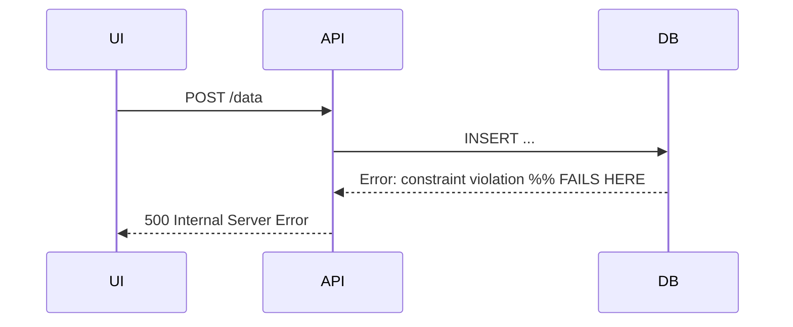
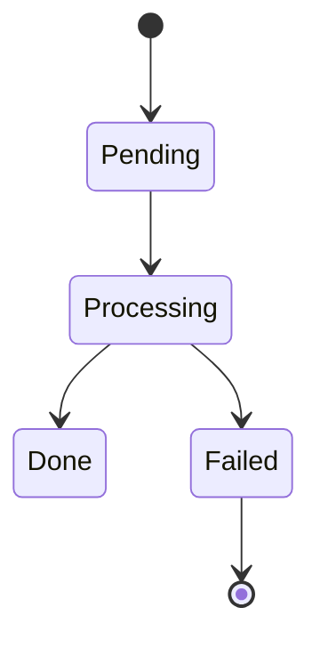

When troubleshooting a problem:

1. **Gather context** by asking clarifying questions if needed:
   - What is the system or component involved?
   - What is the expected behavior vs actual behavior?
   - What are the relevant components, services, or actors?

2. **Choose the right diagram type** based on the problem:
   - **Flowchart**: tracing execution paths, decision logic, or data flow
   - **Sequence diagram**: interactions between services, APIs, or components over time
   - **State diagram**: state machine issues or lifecycle problems
   - **Architecture diagram**: understanding how components connect
   - **Entity-relationship diagram**: data model or database issues

3. **Draw the diagram** using Mermaid syntax in a fenced code block:

   ````
   ```mermaid
   <diagram here>
   ```
   ````

4. **Annotate the problem** to mark where things go wrong in the diagram:
   - Use comments or labels like `%% FAILS HERE` in Mermaid
   - Highlight the divergence point between expected and actual paths
   - If two paths are relevant (happy path vs broken path), show both

5. **Summarize** with 2-3 sentences explaining what the diagram reveals about the root cause or where to investigate next.

### Examples by diagram type

**Flowchart** (decision logic or data flow):
```mermaid
flowchart TD
    A[Request received] --> B{Auth token present?}
    B -- No --> C[Return 401]
    B -- Yes --> D{Token valid?}
    D -- No --> E[Return 403] %% FAILS HERE: token expired
    D -- Yes --> F[Process request]
```

**Sequence diagram** (service interactions):


**State diagram** (lifecycle or state machine):

